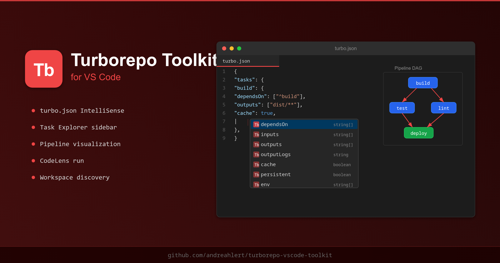
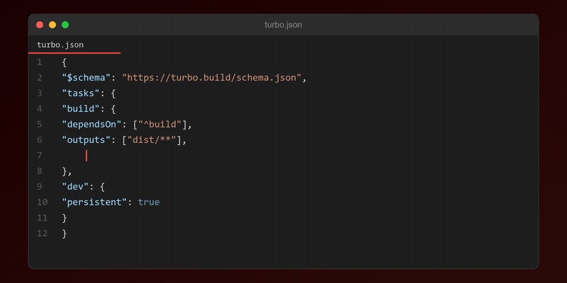
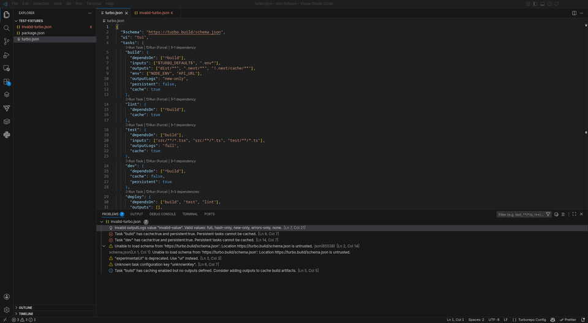
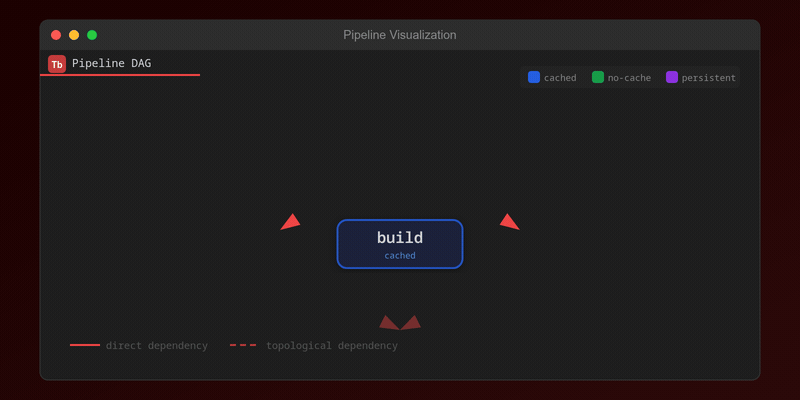

# Turborepo Toolkit

Complete Turborepo toolkit for VS Code. IntelliSense, task explorer, pipeline visualization, and diagnostics for `turbo.json`.

## Features

### IntelliSense

Full autocompletion for `turbo.json` including top-level keys, task configuration options, dependency patterns, glob patterns, and environment variables.

### Task Explorer

Sidebar tree view showing all tasks defined in `turbo.json` with dependency relationships, cache status, inputs/outputs, and environment variables. Click any task to jump to its definition. Run tasks directly from the explorer.

### Pipeline Visualization

Visual DAG of task dependencies rendered as an interactive SVG. Color-coded nodes distinguish cached, uncached, and persistent tasks. Topological dependencies shown with dashed lines. Click any node to navigate to its definition in `turbo.json`.

### CodeLens

Inline actions above each task definition to run the task, run with `--force`, and see dependency count at a glance.

### Hover Documentation

Hover over any key or value in `turbo.json` to see its type, description, default value, and a link to the official Turborepo documentation. Special handling for `$TURBO_DEFAULT$`, topological dependencies (`^build`), glob patterns, and package references.

### Diagnostics

Real-time validation of `turbo.json` including:

- Unknown top-level or task configuration keys
- Invalid `outputLogs` values
- Deprecated keys (`experimentalUI` replaced by `ui`)
- Invalid combinations (`cache: true` with `persistent: true`)
- Missing recommended fields (build tasks without outputs)

### Workspace Package Discovery

Reads `package.json` workspaces or `pnpm-workspace.yaml` to discover all packages in the monorepo. Shows package names, locations, and available scripts in a dedicated sidebar panel.

### Snippets

| Prefix | Description |
|--------|-------------|
| `turbo-task` | Basic task definition |
| `turbo-build` | Build task with common config |
| `turbo-dev` | Dev task (persistent, no cache) |
| `turbo-lint` | Lint task |
| `turbo-test` | Test task with inputs |
| `turbo-deploy` | Deploy task depending on build+test+lint |
| `turbo-config` | Full turbo.json starter |
| `turbo-package` | Package-level turbo.json with extends |

## Commands

| Command | Description |
|---------|-------------|
| `Turborepo: Run Task` | Run a turbo task |
| `Turborepo: Run Task (Force)` | Run a turbo task with --force |
| `Turborepo: Show Pipeline` | Open pipeline visualization |
| `Turborepo: Refresh Tasks` | Refresh the task and package explorers |
| `Turborepo: Go to Task Definition` | Navigate to a task in turbo.json |

## Requirements

- VS Code 1.85.0 or later
- A workspace with a `turbo.json` file
- [Turborepo](https://turbo.build) installed (`npm install turbo --save-dev`)

## Extension Settings

This extension activates automatically when a `turbo.json` file is detected in the workspace.

## Known Issues

Report issues at [GitHub Issues](https://github.com/atoolz/turborepo-vscode-toolkit/issues).

## License

[MIT](LICENSE)
